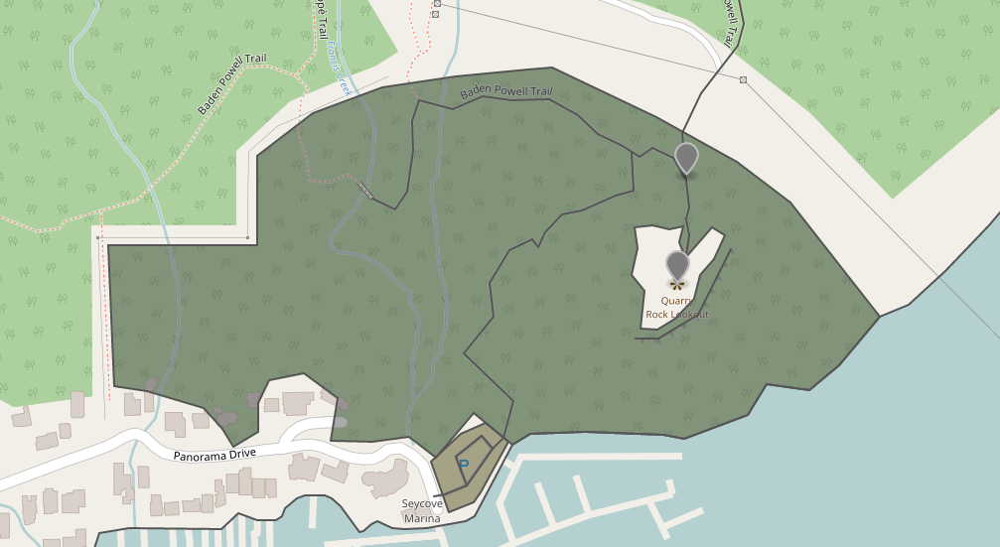
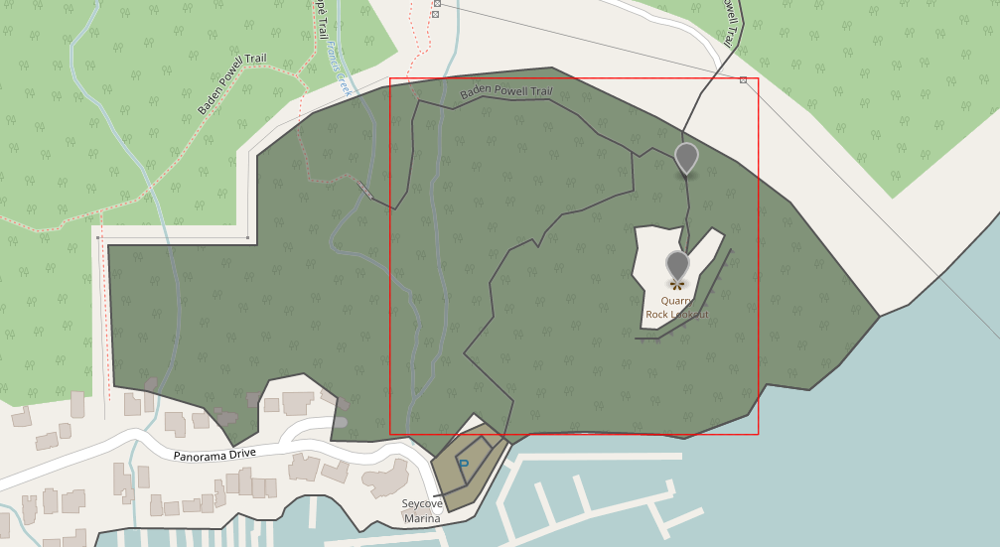
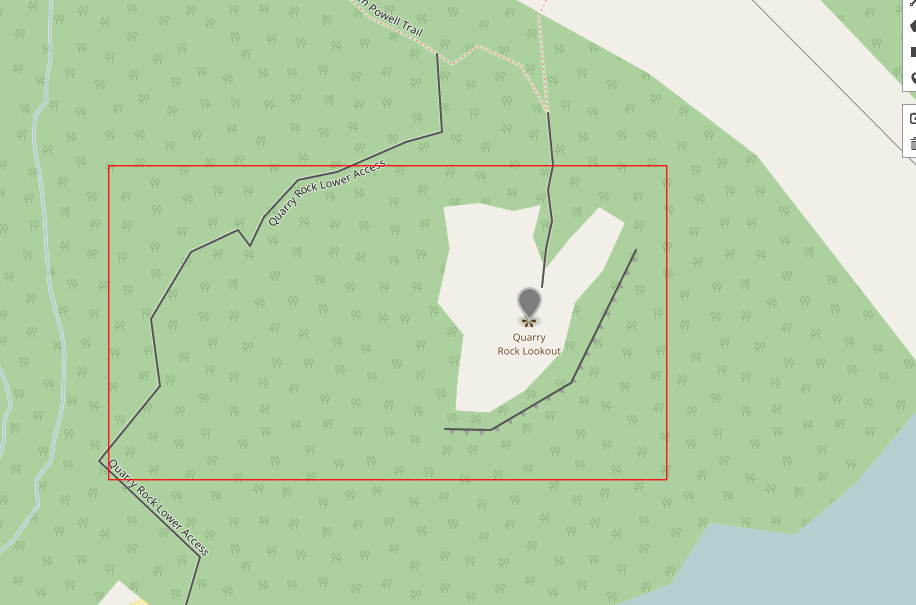

A World's Worth of VectorTiles
==============================

Azavea is pursuing the development of a free-and-open-source pipeline for
mass conversion of [OpenStreetMap](https://www.openstreetmap.org/) data to
[Mapbox VectorTiles](https://www.mapbox.com/vector-tiles/). The project is
called [VectorPipe](https://github.com/geotrellis/vectorpipe) and is based
on [GeoTrellis](http://geotrellis.io), a Scala library also developed by
Azavea.

This post outlines our general approach, our current status, and some of the
roadbumps we've hit along the way.

The Six-fold Path
-----------------

OSM Planet data is freely available in two formats: XML and
[Protobuf](https://en.wikipedia.org/wiki/Protocol_Buffers). Many 3rd-party
sites offer subsets of this data, locked to specific areas (countries /
cities), but we have our sights set on the entire block. The sizes of the
files might at first seem prohibitive: 55gb for XML, and 34gb for Protobuf.
Furthermore, we'd want to parse the dataset in parallel with [Apache
Spark](https://spark.apache.org/) for easy marshalling into GeoTrellis
types. After an [initial foray](https://github.com/fosskers/axe) into
splitting the XML data for subsequent parallel parsing, we abandoned this
approach for another that favours [ORC files](https://orc.apache.org/),
which are designed to be read in parallel from the start.

In converting the source data into a usable set of VectorTiles, we
indentified six key steps:

1. [Convert the OSM Protobuf data into an ORC file](https://github.com/geotrellis/vectorpipe/issues/7)
   - A tool already exists for this, and we are collaborating with the author
   to improve it.
2. [Parse an RDD[Element] from the ORC](https://github.com/geotrellis/vectorpipe/issues/8)
   - Critically, an ORC file can be queried in parallel via Spark SQL, the
   results of which are not hard to marshal to Scala classes.
3. [Convert the `Element`s to GeoTrellis `Feature`s](https://github.com/geotrellis/vectorpipe/issues/3)
   - Lots of "`RDD` algebra", as I've begun calling it
4. [Cut the `Feature`s into a grid](https://github.com/geotrellis/vectorpipe/issues/4)
   - [In progress.](https://github.com/geotrellis/vectorpipe/pull/10)
5. [Convert the grid of `Feature`s to that of `VectorTile`s](https://github.com/geotrellis/vectorpipe/issues/5)
6. [Output the VectorTiles](https://github.com/locationtech/geotrellis/issues/1662)

Luckily Step 1 was "done for us". Code from step 3 is being tested, and step
6 was already possible with our [VectorTile codec
implementation](https://geotrellis.github.io/scaladocs/latest/#geotrellis.vectortile.package).
Step 4 is in progress as this post is being written, while 2 and 5 are pending.

In terms of the actual pipeline code, assuming an ORC file to have been
produced via Step 1, the rest is envisioned simply as:

```scala
import org.apache.spark.sql._
import org.apache.spark.sql.hive._
import vectorpipe.osm._

/* Visible in any application using Spark */
implicit val sc: SparkContext = ...

/* For reading the ORC file via Spark SQL */
implicit val hc: HiveContext = ...

/* How should a `SpatialKey` map to a filepath on S3? */
val s3PathFromKey: SpatialKey => String = SaveToS3.spatialKeyToPath(
  LayerId("sample", 1),
  "s3://some-bucket/catalog/{name}/{z}/{x}/{y}.mvt"
)

/* Filepath to the ORC file */
val orc: String = ...

/* The work */
Orc.readFrom(orc)                                                 // RDD[Row]
  .map(r => Element.parseFile(r))                                 // RDD[Element]
  .toFeatures                                                     // RDD[Feature]
  .toGrid                                                         // RDD[(SpatialKey, Seq[Feature])]
  .mapWithKey({ case (k, fs) => VectorTile.fromFeatures(k, fs) }) // RDD[(SpatialKey, VectorTile)]
  .mapValues(_.toBytes)                                           // RDD[(SpatialKey, Array[Byte])]
  .saveToS3(s3PathFromKey)                                        // Unit
```

where your final output is an S3 bucket of VectorTiles spanning the entire
earth, all for only a few dollars worth of AWS time.

Now, let's delve a bit deeper.

OpenStreetMap Data
------------------

This section acts as a primer and can be skipped if you know how OSM
categorises their data. We'll be referencing the XML form of the data here
for demonstration purposes only.

OpenStreetMap has three primatives, collectively known as Elements. All
Elements have common attributes, and can contain further metadata in
`<tag>`s.

- `Node`
  - Any discrete location on earth, or a "node" in a Way
  - Translates easily to a GeoTrellis `Point` if not part of a Way
- `Way`
  - Some line-like object on the earth, like a road
  - If a Way is "closed", it translates nicely to a GeoTrellis `Polygon` and could represent a building
  - If "open", it becomes a `Line` if also not part of a "Geometric Relation"
- `Relation`
  - Any abstract grouping of Elements
  - Each Relation has a `type` tag, which can be set to anything
  - Some common types are geometric - like `multipolygon` or `boundary` - but these aren't set in stone
  - Multipolygon Relations have agreed-upon semantics for combining many Ways to form large
    Polygonal structures, like
    [enclaves and exclaves](https://en.wikipedia.org/wiki/Enclave_and_exclave)
    between countries
  - Relations can refer to other Relations, forming Relation Graphs
  - Relations store metadata relavent to the entire structure

Visual examples:

```xml
<node id="300006332" visible="true" version="2" changeset="11137522" timestamp="2012-03-29T12:06:03Z" user="Divjo" uid="63375" lat="24.3102749" lon="68.8355605"/>

<way id="19551824" visible="true" version="1" changeset="512823" timestamp="2008-01-02T12:20:13Z" user="dmgroom_coastlines" uid="4772">
  <nd ref="202991342"/>
  <nd ref="202993872"/>
  <nd ref="202993694"/>
  <nd ref="202993703"/>
  ...
  <tag k="admin_level" v="2"/>
  <tag k="border_type" v="nation"/>
  <tag k="boundary" v="administrative"/>
  ...
</way>

<relation id="549971" visible="true" version="2" changeset="4379439" timestamp="2010-04-10T05:58:16Z" user="Marcott" uid="173927">
  <member type="way" ref="54928207" role="outer"/>
  <member type="way" ref="54928404" role="inner"/>
  <tag k="type" v="multipolygon"/>
</relation>
```

Reading Data from ORC
---------------------

By [adding a
dependency](https://github.com/fosskers/playground/blob/master/scala/orc/build.sbt#L9),
Spark code gains the ability to query ORC files via SparkSQL. This discovery
was a big relief, as it presents itself as an elegant solution to a problem
we were approaching with custom code. Reading and marshalling to Scala
classes is as easy as:

```scala
/* The type to marshal to */
case class Node(id: Long, tags: Map[String, String], lat: BigDecimal, lon: BigDecimal)

implicit val hc: HiveContext = ...

/* A lazy reader */
val data = hc.read.format("orc").load("VA.orc")

val nodes: RDD[Node] =
  data
    .select("id", "tags", "lat", "lon")
    .where("type = 'node'")
    .as[Node]
    .rdd
```


Here is a [fuller
example](https://github.com/fosskers/playground/blob/master/scala/orc/src/main/scala/playground/Orc.scala).

There is much more work to be done in this area, but this is a good start.
Once employed, it gives us a full `RDD[Element]` from ORC data, which we can
convert to GeoTrellis types for further processing.

Conversion to GeoTrellis `Feature`s
-----------------------------------

### Relations

Here be dragons, and Relations birthed them hence. Recall that:

1. Each Relation has a `type` tag, which can be set to anything
2. Relations store metadata relevant to the entire structure
3. Relations can refer to other Relations, forming Relation Graphs

(1) means that we (the GeoTrellis team) have to draw a line in the sand for
which Relations we need to give special treatmeat when converting from
`Element` to `Feature`. Geometric Relations like `multipolygon` and
`boundary` are obvious, but further out than that and the answer isn't so
clear.

One example of a "non-geometric Relation" would be a bus route, composed of
many Nodes and Ways. Each single Node could be a busstop or bus depot, while
the Ways show the actual route. In an actual display of a VectorTile
containing this bus route, it would be good to see each busstop on the map,
and also be able to confirm (via mouse-over metadata display, etc.) that any
given node is in fact a stop. The Nodes themselves (in the OSM DB or XML
form) have no idea they're part of a route. In fact, one stop could be a
member of multiple routes, and thus multiple Relations. *Relations know who
they contain, but not the other way around.* This is where (2) comes in.
Relations store the structure-wide metadata, but for the final Node to know
about it, the Relation's metadata has to be disseminated across its members.

And how hard could that be? Well, recall (3). What if your bus route is
itself pointed to by a higher Relation? Now we have Relation Graphs to deal
with. After consulting with OSM contributors in [their
IRC](http://irc.openstreetmap.org/), the concensus is that while these
Relations *should* form Tree structures, there's no guarantee that they will
because of the permissive way their data-type relationships are defined
(i.e. Relations can refer to anything). There's also no guarantee that the
Graphs found won't be cyclic.

Our answer is to apply Graph theory and force a Tree structure, essentially
declaring Relation Graphs to be illegal. We ported an [established `Graph`
implementation](https://downloads.haskell.org/~ghc/latest/docs/html/libraries/containers-0.5.7.1/Data-Graph.html)
to Scala and gave it the operation:

```scala
topologicalForest[K, V]: Graph[K, V] => Forest[V]
```

where `type Forest[T] = Seq[Tree[T]]`.

This gives us a sensible method for interating across Relations and
disseminating their metadata to their children.

### Conversion Quirks

Polygons can be formed in three ways:

- From a single "closed" Way
- From a `multipolygon` Relation that designates which Ways to stitch together
- From a combination of the above two, forming holed Polygons

Here is a real example we can analyse. The gray-black areas/lines are our
converted data laid over the original OSM map.



Here, the bottom-most shape (containing the P) is a single, closed Way.
Above it is a two-Way multipolygon representing a forest with a large rock
to one side. The other black lines snaking about are single Ways. Here is
the same shot from Google Maps for context:


Quarry Rock itself is represented in OSM as a hole in the forest around it.
This is a pretty normal holed Polygon. We've seen the XML for this Relation
already, in the XML examples above. Interestingly, the bounding box which produced
all this was smaller than you might expect:



This is due to how OpenStreetMap's "Export" utility works. The rough algorithm is:

1. Find all Nodes within the bounding box
2. Find all Ways which reference those Nodes
  - If not all Nodes referenced by a Way in this bbox are present, grab them
  anyway (non-recursively, this won't go out and find yet more Ways based on
  the new Nodes).
3. Find all Relations which reference those Nodes and Ways
  - Unlike Ways, even if a Relation refers to other Elements outside the
  bbox, *don't* fetch them. This prevents a flood of long Ways outside the
  bbox   from being added by mistake, producing large XML.

So the full forest Polygon we see here is because of rule (2). What happens
if we grab the XML for a smaller bounding box?



Hm, no Polygon present that represents the Rock. Checking the XML, the Way
for the Rock and the Relation for the whole forest *were* fetched, but
critically the outer Way for the forest edge was not. In this case, our
algorithm abandons the attempt to make the holed Polygon.

A similar thing can happen to stray Ways which ought to be stitched
together, but can't be due to the caveat in (3) above. This was a source of
strange Exceptions for a while. For now we abandon such Ways, knowing that
they *would* be properly fused if using the full data set.

Current Work
------------

I personally am continuing work at Step 4, predicting a move to Step 5
sometime next week. With the finalization of Step 2, we can at last begin
producing VectorTiles to gauge performance and start some preliminary
analysis. We're excited for what this project will mean for both Azavea and
the greater GIS community, so stay tuned.
